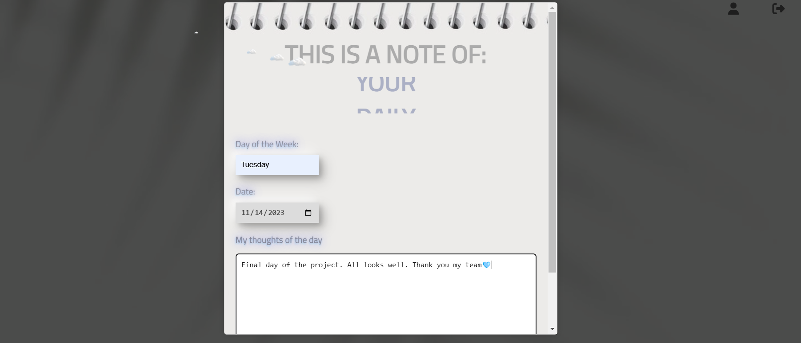

# SweetDreams

Struggling to get a good night's sleep? We recommend to try a Sweet Dreams app. It can be a helpful tool for improving sleep quality and overall health and well-being.

## Contributors

- [Oksana Prokopieva](https://github.com/oprokopieva382)
- [Frieda Fry](https://github.com/FriedaHF)
- [Yasin Hubbard](https://github.com/Hubbard1118)
- [Jorlyna Pujols](https://github.com/jorlyna326)

## Screenshots

    Welcome to the Sweet Dreams Homepage!

    How about we log in ---

    Which page to choose? Pick in profile page..

    Some Relaxing Music ---

    Meditation Videos --- 

    Boring Books ---

    Find your liked video, songs or books in favorite ---

    How about a little note of your thoughts --- 

    For a more in-depth view of the page --- ⬇️

## Demo

[Deployed Website](https://sweetdreamsproject-8e54b05db96b.herokuapp.com/)

[Repository](https://github.com/oprokopieva382/sweetDreams)

## Acknowledgements
- Supportive links provided by Teacher's Assistant [Mary Elenius](https://github.com/404pandas)

- Helpful links found on the WEB

## License

This project is licensed under the **MIT license**.

## Technologies

